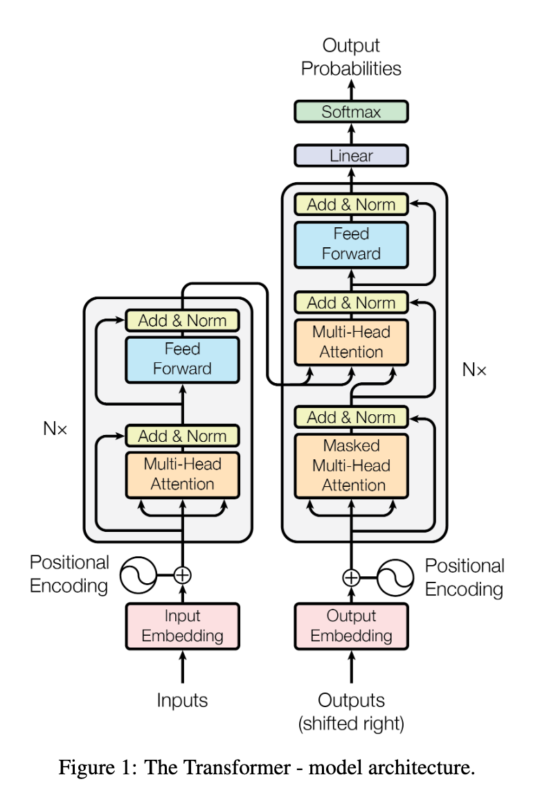

# Attention Is All You Need 主要内容总结

"Attention Is All You Need" 论文介绍了Transformer模型，它在自然语言处理(NLP)领域引发了巨大的变革。Transformer模型的核心创新是自注意力机制，它允许模型在进行预测时对句子中不同词语的重要性进行加权。

## 主要概念

在Transformer模型出现之前，循环神经网络（RNNs）及其变体（如LSTM和GRU）是处理序列数据的常用方法。然而，RNNs在处理长序列时面临梯度消失和梯度爆炸的问题，难以捕捉长距离依赖关系。此外，RNNs的顺序计算方式限制了并行化，影响了训练效率。为了解决这些问题，自注意力机制应运而生。

| 特性          | RNNs (如 LSTMs)                                    | 自注意力机制 (Transformer)                     |
| ------------- | -------------------------------------------------- | ---------------------------------------------- |
| 核心思想      | 循环处理序列，隐状态传递信息                       | 对序列中所有位置的信息进行加权平均             |
| 擅长处理      | 短序列                                             | 长序列                                         |
| 依赖关系      | 擅长处理相邻词之间的关系，长距离依赖较弱           | 能够有效捕捉长距离依赖关系                     |
| 并行化        | 难以并行化，因为计算依赖于前一个时间步的输出       | 易于并行化，可以同时处理序列中的所有位置       |
| 梯度消失/爆炸 | 容易出现梯度消失或梯度爆炸问题，影响长序列训练效果 | 通过残差连接和层归一化等技术，减轻梯度消失问题 |
| 复杂度        | 时间复杂度 O(n)，n是序列长度                       | 时间复杂度 O(n^2)，但可以通过优化减少复杂度    |

**Transformer模型的架构**如下图所示：

**Transformer架构主要创新点**：

1. **自注意力机制 (Self-Attention Mechanism)**：
   自注意力机制使模型能够在编码一个词语时关注输入句子中的不同部分，从而捕捉长距离依赖关系和词语之间的关系。
2. **Transformer架构 (Transformer Architecture)**：
   Transformer模型由编码器 (Encoder) 和解码器 (Decoder) 两部分组成。编码器处理输入句子，而解码器生成输出句子。两部分都使用自注意力机制和前馈神经网络。
3. **位置编码 (Positional Encoding)**：
   由于Transformer模型不具备顺序信息，位置编码用于向模型注入每个词语在序列中的位置信息。
4. **多头注意力 (Multi-Head Attention)**：
   这种技术允许模型同时关注句子的不同部分，通过使用多个注意力头，每个头学会捕捉输入的不同方面。
5. **前馈神经网络 (Feed-Forward Neural Networks)**：
   在应用自注意力机制之后，输出通过前馈神经网络进行进一步处理。

## 关键原理

假设输入序列为 $X = (x_1, x_2, \ldots, x_n)$，自注意力机制的计算可以表示为：

$$
\text{Attention}(Q, K, V) = \text{softmax}\left(\frac{QK^T}{\sqrt{d_k}}\right)V
$$

其中，$Q$ (查询)、$K$ (键) 和 $V$ (值) 是通过输入序列 $X$ 线性变换得到的矩阵，$d_k$ 是键向量的维度。具体来说：

- **Q (Queries，查询)**：表示当前需要关注的信息。在自注意力中，每个词都会生成一个查询向量，用于与其他词的键向量进行比较，以确定应该关注哪些词。
- **K (Keys，键)**：表示被查询的信息。每个词都会生成一个键向量，用于与查询向量进行匹配，以评估其与当前词的相关性。
- **V (Values，值)**：表示与键对应的值。每个词也会生成一个值向量，用于根据注意力权重对信息进行加权求和，从而得到最终的表示。

多头注意力机制的公式如下：

$$
\text{MultiHead}(Q, K, V) = \text{Concat}(\text{head}_1, \ldots, \text{head}_h)W^O
$$

其中，每个注意力头的计算为：

$$
\text{head}_i = \text{Attention}(QW_i^Q, KW_i^K, VW_i^V)
$$

## 例子

考虑句子："The cat sat on the mat."

- **自注意力**：模型会关联 "cat" 和 "sat"，因为猫在执行坐的动作。此外，它还能学习到 "on" 和 "mat" 之间的关系，因为 "on" 描述了 "mat" 的位置，从而模型能够理解猫坐在垫子上这个整体场景。
- **位置编码**：位置编码确保模型知道 "The" 是句子的第一个词，"cat" 是第二个，依此类推。这对于理解句子的结构至关重要，因为改变词的顺序会改变句子的意思。例如，"mat the on sat cat" 就没有意义。
- **多头注意力**：一个头可能关注 "cat" 和 "sat" 之间的主谓关系，另一个头可能关注 "sat" 和 "on the mat" 之间的位置关系。通过这种方式，模型可以同时理解猫的动作和发生的地点，从而更全面地理解整个句子。

## 结论

Transformer模型通过自注意力机制，极大地改进了我们处理和理解语言的方式。它就像一个超级聪明的读者，知道该关注哪些词语以及它们之间的关系。目前，Transformer已成为构建大型语言模型（LLM）的主流架构。例如，GPT系列（如GPT-3, GPT-4）、BERT、T5等都是基于Transformer的。这些模型被广泛应用于各种NLP任务，包括文本生成、机器翻译、问答系统、文本摘要等。自注意力机制使得这些模型能够处理更长的文本序列，并捕捉到词语之间复杂的依赖关系，从而在各种任务中取得state-of-the-art的表现。

## 参考文献

您可以在 [GitHub 仓库](../../references/Attention%20Is%20All%20You%20Need.pdf) 中找到完整的论文。
