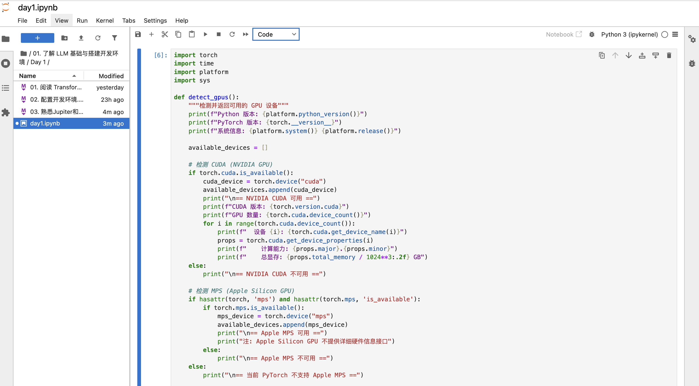
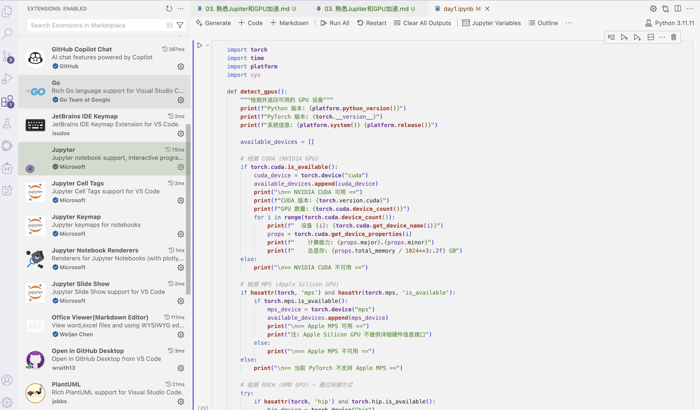

# 熟悉 Jupyter Notebook 和 GPU 加速环境

在现代深度学习和数据科学领域，**Jupyter Notebook** 和 **GPU 加速** 成为不可或缺的工具。Jupyter
Notebook 提供了交互式的编程环境，而 GPU加速环境能够大幅提升深度学习模型训练速度。有了这两者的结合，开发者可以快速实现数据分析与模型构建的迭代。

本文将带你了解 Jupyter Notebook 的基本使用，以及如何配置和使用GPU加速环境（如 Google Colab 或本地
GPU）。

---

## 一、Jupyter Notebook 简介与安装

### 1.1 什么是 Jupyter Notebook？

Jupyter Notebook 是开源的交互式开发工具，支持多种编程语言（如 Python、R、Julia 等）。它的核心特性包括：

- 所见即所得的代码执行：分单元格运行，方便调试和可视化。
- 强大的 Markdown 支持，用于记录笔记和生成文档。
- 丰富的第三方扩展（插件），支持复杂的计算工作流。

### 1.2 安装 Jupyter Notebook

如果已经安装了 Python，可以通过 `pip` 安装 Jupyter Notebook：

```bash
pip install notebook
```

安装完成后，可以通过以下命令启动 Jupyter Notebook：

```bash

jupyter notebook

```

启动后会在浏览器中打开一个 **Web 界面**，用户可以直接在界面中新建或编辑 `.ipynb` 文件，并开始写代码。界面如下：



### 1.3 通过VS Code 使用 Jupyter Notebook

如果你使用 VS Code 作为 IDE，可以通过安装 Jupyter 扩展来直接在 VS Code 中使用 Jupyter Notebook。安装完成后，打开 `.ipynb` 文件即可开始编辑。



---

## 二、本地 GPU 环境配置

深度学习模型的训练通常需要高性能计算，而 GPU 是专为并行计算优化的硬件，可以显著加速模型训练。以下介绍如何在本地环境中配置 GPU
加速。

### 2.1 检查 GPU 是否可用

首先检查你的机器是否配备了 GPU，以及是否安装了适当的 GPU 驱动。可通过以下命令查看（适用于 NVIDIA GPU 用户）：

| 特性           | NVIDIA CUDA          | AMD ROCm                | Apple MPS               | Intel OneAPI    |
| -------------- | -------------------- | ----------------------- | ----------------------- | --------------- |
| 适用硬件       | NVIDIA GPU           | AMD GPU                 | Apple Silicon/Metal GPU | Intel GPU/CPU   |
| 市场占有率     | 高（数据中心/研究）  | 中等                    | 仅限 Apple 设备         | 新兴            |
| 生态系统成熟度 | 非常成熟             | 发展中                  | 快速成长                | 发展中          |
| 框架支持       | 全面（所有主流框架） | 有限（主要 PyTorch/TF） | 有限（主要 PyTorch）    | 有限            |
| 开发难度       | 中等                 | 中等                    | 较低                    | 中等            |
| 部署环境       | 服务器/工作站/笔记本 | 服务器/工作站           | Mac 设备                | 多种 Intel 硬件 |
| 适合任务       | 通用 AI/ML/HPC       | 通用 AI/ML              | 移动/桌面 AI 应用       | 多样化计算      |
| PyTorch 集成   | torch.cuda           | torch.hip               | torch.mps               | 支持中          |

PyTorch 中的 GPU 检测代码，以下是适用于各种 GPU 平台的 PyTorch 检测与使用代码：

```bash
import torch
import time
import platform
import sys

def detect_gpus():
    """检测并返回可用的 GPU 设备"""
    print(f"Python 版本: {platform.python_version()}")
    print(f"PyTorch 版本: {torch.__version__}")
    print(f"系统信息: {platform.system()} {platform.release()}")
  
    available_devices = []
  
    # 检测 CUDA (NVIDIA GPU)
    if torch.cuda.is_available():
        cuda_device = torch.device("cuda")
        available_devices.append(cuda_device)
        print("\n== NVIDIA CUDA 可用 ==")
        print(f"CUDA 版本: {torch.version.cuda}")
        print(f"GPU 数量: {torch.cuda.device_count()}")
        for i in range(torch.cuda.device_count()):
            print(f"  设备 {i}: {torch.cuda.get_device_name(i)}")
            props = torch.cuda.get_device_properties(i)
            print(f"    计算能力: {props.major}.{props.minor}")
            print(f"    总显存: {props.total_memory / 1024**3:.2f} GB")
    else:
        print("\n== NVIDIA CUDA 不可用 ==")
  
    # 检测 MPS (Apple Silicon GPU)
    if hasattr(torch, 'mps') and hasattr(torch.mps, 'is_available'):
        if torch.mps.is_available():
            mps_device = torch.device("mps")
            available_devices.append(mps_device)
            print("\n== Apple MPS 可用 ==")
            print("注: Apple Silicon GPU 不提供详细硬件信息接口")
        else:
            print("\n== Apple MPS 不可用 ==")
    else:
        print("\n== 当前 PyTorch 不支持 Apple MPS ==")
  
    # 检测 ROCm (AMD GPU) - 通过间接方式
    try:
        if hasattr(torch, 'hip') and torch.hip.is_available():
            hip_device = torch.device("hip")
            available_devices.append(hip_device)
            print("\n== AMD ROCm (HIP) 可用 ==")
        else:
            print("\n== AMD ROCm (HIP) 不可用 ==")
    except:
        print("\n== 当前 PyTorch 不支持 AMD ROCm ==")
  
    # 始终有 CPU
    cpu_device = torch.device("cpu")
    available_devices.append(cpu_device)
  
    return available_devices

def benchmark_device(device, size=5000):
    """对指定设备进行矩阵乘法性能测试"""
    print(f"\n在 {device} 上测试 {size}x{size} 矩阵乘法性能...")
  
    # 创建 CPU 张量
    a_cpu = torch.randn(size, size)
    b_cpu = torch.randn(size, size)
  
    # 转移到目标设备
    try:
        a = a_cpu.to(device)
        b = b_cpu.to(device)
  
        # 预热
        _ = torch.matmul(a, b)
  
        # 计时
        start = time.time()
        c = torch.matmul(a, b)
  
        # 确保完成计算
        if device.type == "cuda":
            torch.cuda.synchronize()
        elif device.type == "mps":
            torch.mps.synchronize()
        elif hasattr(torch, 'hip') and device.type == "hip":
            torch.hip.synchronize()
  
        # 如果是 GPU，转回 CPU 以确保操作完成
        if device.type != "cpu":
            _ = c.to("cpu")
    
        duration = time.time() - start
        print(f"{device} 计算时间: {duration:.4f} 秒")
        return duration
    except Exception as e:
        print(f"在 {device} 上测试失败: {e}")
        return None

# 主函数
def main():
    print("=" * 60)
    print("PyTorch GPU 检测与性能测试")
    print("=" * 60)
  
    # 检测可用设备
    available_devices = detect_gpus()
  
    if len(available_devices) <= 1:  # 只有 CPU
        print("\n没有检测到可用的 GPU 设备，仅有 CPU 可用。")
        benchmark_device(torch.device("cpu"), size=2000)
        return
  
    # 为每个设备运行基准测试
    cpu_time = benchmark_device(torch.device("cpu"), size=2000)
  
    for device in available_devices:
        if device.type != "cpu":
            gpu_time = benchmark_device(device, size=2000)
            if cpu_time and gpu_time:
                print(f"{device} 加速比: {cpu_time/gpu_time:.2f}x")

# 运行主函数
if __name__ == "__main__":
    main()

```

执行上述代码后，你将看到类似以下的输出：

```
============================================================
PyTorch GPU 检测与性能测试
============================================================
Python 版本: 3.11.11
PyTorch 版本: 2.0.1
系统信息: Darwin 23.6.0

== NVIDIA CUDA 不可用 ==

== 当前 PyTorch 不支持 Apple MPS ==

== AMD ROCm (HIP) 不可用 ==

没有检测到可用的 GPU 设备，仅有 CPU 可用。

在 cpu 上测试 2000x2000 矩阵乘法性能...
cpu 计算时间: 0.3548 秒
```

## 三、云端 GPU 加速环境

如果您没有强大的本地 GPU，或者需要更强大的计算能力，云端 GPU 服务是理想的选择。

**不同平台的GPU对比**：

| 平台                     | GPU 类型 | 性能倍数* | 内存    | 典型费用/小时 | 适用场景       |
| ------------------------ | -------- | --------- | ------- | ------------- | -------------- |
| Google Colab (免费)      | T4/P100  | 1x        | 12-16GB | 免费          | 学习、小实验   |
| Kaggle (免费)            | P100     | 1x        | 16GB    | 免费          | 数据竞赛       |
| AWS p3.2xlarge           | V100     | 2-3x      | 16GB    | $3.06         | 研究、中型模型 |
| AWS p4d.24xlarge         | 8x A100  | 25-30x    | 320GB   | $32.77        | 大型模型训练   |
| GCP n1-standard-8 + V100 | V100     | 2-3x      | 16GB    | $2.48         | 研究、中型模型 |
| Lambda A100              | A100     | 5-7x      | 40GB    | $2.50         | 高性能需求     |
| Vast.ai (RTX 3090)       | RTX 3090 | 1.5-2x    | 24GB    | $0.40         | 性价比高的训练 |

*_性能倍数以 P100 为基准进行比较_

**选择云 GPU 的考虑因素**：

- **模型规模**: 小型模型 (Colab/Kaggle)，中型模型 (单 V100/A100)，大型模型 (多 GPU A100)
- **训练时间**: 短期 (Colab)，中期 (Vast.ai)，长期 (AWS 预留实例)
- **预算**: 免费 (Colab/Kaggle)，低预算 (Vast.ai)，高预算 (AWS/GCP)

## 五、总结

Jupyter Notebook 和 GPU 加速是现代数据科学和人工智能工作流程的重要组成部分。本文介绍了 Jupyter
Notebook 的安装与使用方法，以及如何在代码中检测 GPU 的可用性和性能。同时我们也介绍了不同的云 GPU
服务平台，帮助你选择最适合的 GPU 计算资源。

通过合理地结合这两种工具，可以显著提高人工智能模型开发的效率。如果你还未尝试这些工具，赶快行动吧！

---

**参考资料：**

- [Jupyter 官网](https://jupyter.org/)
- [Google Colab
  官方文档](https://colab.research.google.com/notebooks/intro.ipynb)
- [PyTorch 官方文档](https://pytorch.org/)
- [TensorFlow 官方文档](https://www.tensorflow.org/)
